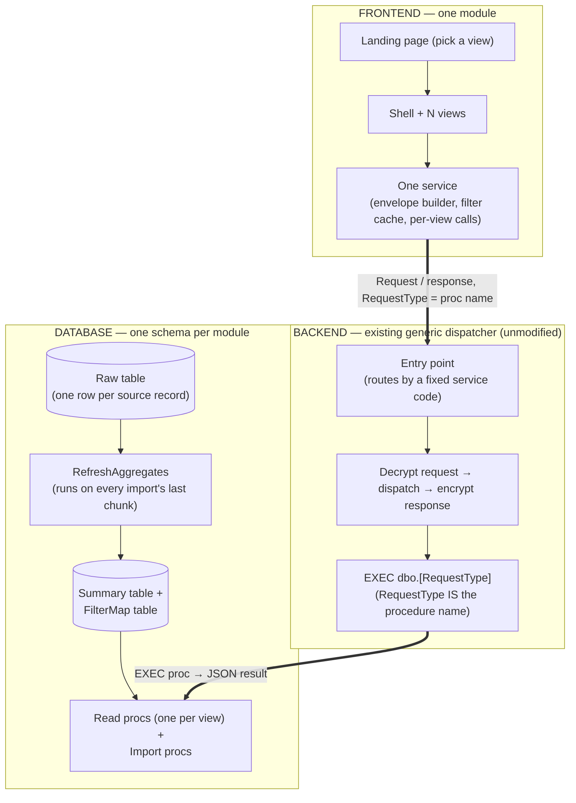

# Dashboard UI/UX Framework

This directory documents — and, in `src/`, actually **implements** — a
**reusable pattern** for building a "pick a dataset → many filtered/grouped
views → bulk import → live dashboard" module. It makes no assumption about
*what* the data is — point it at any single-table dataset and the same
shape (schema, dispatcher usage, module layout, filtering) applies
unchanged.

**Core idea in one line**: one raw table → one pre-aggregated summary table
→ one filter-map table → N read views, all served through a generic,
already-existing backend dispatcher with **zero new backend code**, behind
one frontend module (landing page → shell → views → one shared service).

Directory layout:

```
UI-UX Framework/
├── README.md              -- you are here: entry point, checklist, generic file structure
├── docs/                  -- detailed, per-layer reference documentation
│   ├── Database.md
│   ├── Backend.md
│   ├── Frontend.md
│   └── Flow.md
└── src/                   -- the actual reusable code (see src/README.md)
```

Companion documents:

| Document | Covers |
|---|---|
| `docs/Database.md` | Table shapes, indexes, the automated import→refresh pipeline, the stored-procedure catalog, classification/ratio-metric patterns |
| `docs/Backend.md` | The request/response envelope, the generic dispatcher call chain, response codes, import as a separate concern |
| `docs/Frontend.md` | Routing, component inventory, the service layer, faceted filtering, dual-basis metrics, models, export, styling conventions |
| `docs/Flow.md` | Visual, end-to-end flow diagrams (architecture, request/response sequence, import path) |
| `src/` | The actual reusable code: 6 shared Angular components, the SCSS design-token/table layer, and the two generic model types — drop-in ready, described in `docs/Frontend.md` §2/§8 and detailed in `src/README.md` |

---

## 1. When this pattern fits

- A single, self-contained dataset (not a multi-dataset picker).
- Users need several different **groupings/pivots** of the same underlying
  rows (e.g. "by region", "by team", "by status", plus a flat detail view
  and a raw row browser).
- A **hierarchy of filter dimensions** (2–6 levels) that should narrow each
  other, in any order.
- Data arrives in **bulk imports** (a file), not row-by-row transactional
  writes — the read side can be pre-aggregated and rebuilt wholesale on
  every import instead of staying live.
- The rest of the platform already has a **generic RPC-style dispatcher**
  (request carries a "which procedure" field; the backend executes it
  by name) — this pattern adds zero code to that layer, only new stored
  procedures.

If any of those don't hold — live/streaming writes, a dataset picker with
many independent datasets, no existing generic dispatcher — this specific
shape needs adapting.

---

## 2. Generic file structure

```
DB_Scripts/{ModuleName}/
├── 01_Schema.sql                     -- tables + indexes (idempotent: CREATE IF NOT EXISTS)
└── 02_Stored_Procedures.sql          -- all procs (idempotent: CREATE OR ALTER)

src/app/pages/{module-name}/
├── {module-name}.module.ts           -- NgModule: declarations + shared-component imports
├── {module-name}-routes.ts           -- landing page (outside shell) + N views (inside shell)
├── {module-name}.service.ts          -- ONE service: envelope builder, filter cache, per-view calls
├── {module-name}.models.ts           -- response-shape interfaces, matches proc output field-for-field
├── _{prefix}-tokens.scss             -- design tokens + base table/filter styling
├── _{prefix}-table-veil.scss         -- (optional) shared visual treatment for split/frozen tables
│
├── landing/
│   └── landing.component.*           -- view picker cards
│
├── shell/
│   └── shell.component.*             -- breadcrumb/nav-tabs wrapper, <router-outlet> for views
│
├── views/                            -- one folder per dashboard screen
│   ├── overview/                     -- unfiltered KPI/summary view (optional but common)
│   ├── {dimension-1}-wise/           -- grouped by one hierarchy level
│   ├── {dimension-2}-wise/           -- grouped by two hierarchy levels, pivoted
│   ├── ...                           -- one folder per grouping the users need
│   ├── {finest-grain}-detail/        -- flat row per lowest-level entity, full filter bar
│   └── source-data/                  -- raw, sortable/filterable row browser
│
├── shared/                           -- reusable across every view, not duplicated
│   ├── multi-select/                 -- checkbox dropdown, virtual-scrolled for long option lists
│   ├── pivot-table/                  -- generic "N group-by columns + M pivoted metric columns" renderer
│   ├── export-button/                -- exports exactly what's on screen, client-side, bordered spreadsheet
│   ├── paginator/                    -- client-side pager
│   ├── tier-legend/                  -- (optional) legend/filter for any tiered ratio metric
│   └── table-hscroll/                -- restores a visible scrollbar for a split/frozen table
│
└── import/                           -- (optional) only if this module owns its own data ingestion
    └── import.component.*
```

Everything under `views/` and the six `shared/` components are the only
parts that grow with the number of screens — the module shell, service, and
models stay at one file each regardless of how many views exist.

---

## 3. Generic architecture (three layers, zero new backend code)



**Why zero new backend code works**: the dispatcher never branches on which
procedure is being called — it takes `RequestType` from the request and
executes a SQL command with that exact name, passing through the same fixed
parameter list every time. Adding a new view means adding a new stored
procedure with that same fixed signature; the backend layer doesn't change.
The one constraint this imposes: **every** procedure in the module —
regardless of what it actually reads or writes — must declare the identical
parameter list the dispatcher always sends.

---

## 4. Generic naming convention

| Pattern | Meaning |
|---|---|
| `{RawTable}` | One row per source record |
| `{RawTable}_ImportBatch` | One row per uploaded file |
| `{RawTable}_ImportLog` | Row-level import errors |
| `{Module}_Summary` | Pre-aggregated, one row per finest-grain entity |
| `{Module}_FilterMap` | Distinct filter-dimension combinations |
| `{Prefix}_LoadFilters` | Every dropdown's options, one call |
| `{Prefix}_Overview` | Unfiltered KPI/summary view |
| `{Prefix}_{Dimension}Wise` | Grouped-by-one-or-more-dimensions view (one per useful grouping) |
| `{Prefix}_{Grain}Detail` | Flat row per finest-grain entity |
| `{Prefix}_SourceData` | Raw row browser |
| `{Prefix}_RefreshAggregates` | Rebuilds Summary + FilterMap |
| `{Prefix}_ImportData` | Chunked bulk insert |
| `{Prefix}_GetImportProgress` | Import status/resume check |

---

## 5. Reusable design decisions worth keeping as-is

These are the parts of the pattern that carry over regardless of dataset —
copy the mechanism, not just the shape:

| Decision | Why it generalizes |
|---|---|
| One consolidated summary table at the **finest grain any view needs**, not one summary table per view | Every grouped view just `GROUP BY`s a subset of the same columns at read time — one source of truth, one place the aggregation math lives |
| A separate, small **FilterMap** table for dropdown options, not `SELECT DISTINCT` off the raw table | Keeps every filter dropdown fast regardless of raw-table size; only needs the dimension columns, not the full row width |
| **FilterMap population excludes whatever the Summary table excludes** | Without this, a dropdown can offer a filter combination the data source has already dropped, producing an unexplained empty result |
| Import → RefreshAggregates as **one atomic transaction** | Raw data and its aggregates are never inconsistent with each other; no separate scheduled refresh job to keep in sync |
| Chunked import does **constant work per chunk** (no full-batch classification pass on the last chunk alone) | Avoids the last-chunk timeout failure mode that shows up the moment a file is large |
| Client-side **faceted, order-independent filtering** off one raw dimension-combination payload, fetched once per session | Every filter narrows every other filter symmetrically without a fixed pick order, and after the first fetch, filter interactions need zero further network calls |
| One shared **pivot-table renderer**, parameterized by which columns are "left/group" vs "pivoted metric" | Avoids duplicating the same grid markup once per grouped view |
| **Export renders exactly what's on screen** (same rows, same formatting), not a fresh unfiltered query | What a user exports always matches what they were looking at |
| A **sequence-number guard** on each view's own load, not just a loading flag | An older in-flight request finishing after a newer one must never clobber the newer result |

---

## 6. Stand up a new module — checklist

1. **Define the dataset**: one raw table, its natural finest grain, and the
   2–6 dimension columns you want as cross-filtering dropdowns.
2. **Schema** (`01_Schema.sql`): raw table + `_ImportBatch` + `_ImportLog`,
   a `{Module}_Summary` table pre-aggregated at your finest grain, a
   `{Module}_FilterMap` table with just the dimension columns.
3. **Procs** (`02_Stored_Procedures.sql`): `{Prefix}_LoadFilters`,
   `{Prefix}_RefreshAggregates`, `{Prefix}_ImportData`,
   `{Prefix}_GetImportProgress`, plus one read proc per view — every proc
   declaring the exact same fixed parameter list your dispatcher always
   sends.
4. **Backend**: nothing to write. Confirm the dispatcher's fixed parameter
   list matches what your new procs declare, and that's the entire backend
   integration.
5. **Frontend**: copy the module skeleton from §2, rename, wire routes for
   your views, implement each view's own filter fields + `load()`. Reuse
   the shared components as-is; only the pivot-table's column config and
   the service's per-view methods are new.
6. **Filtering**: define your own facet-key union matching your dimension
   columns; the prefetch/cache/faceted-narrowing logic (`docs/Frontend.md` §4)
   is a drop-in port regardless of dataset — only the facet-key list
   changes.
