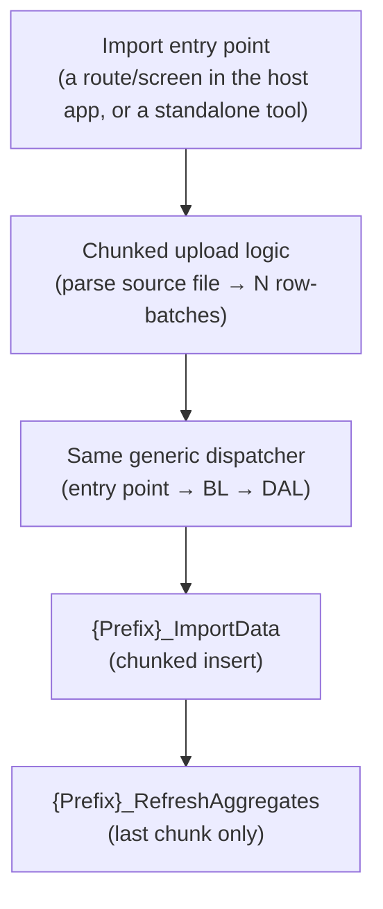

# Dashboard UI/UX Framework — Backend Layer (Generic)

The core idea: **no module-specific backend code**. This pattern only works
where the platform already has a **generic, RPC-style dispatcher** — a
request carries "which server operation to run" as a plain string field,
and the backend executes it by name, with no per-operation branching. Adding
a new dashboard view means adding a new stored procedure; the backend layer
itself never changes.

If no such dispatcher exists yet, building one (once, platform-wide) is a
prerequisite for this whole pattern — it is *not* something this module
should own or duplicate.

---

## 1. Request/response envelope

A fixed shape, routed by one constant "service code" naming this generic
operation-by-name dispatcher:

| Field | Direction | Type | Notes |
|---|---|---|---|
| `Owner` | Request | string | Whichever top-level scope this request runs under (tenant/org/session) |
| `RequestType` | Request | string | **The stored procedure name**, verbatim |
| Scope fields (e.g. a secondary scope, a sub-scope) | Request | string | Passed straight through to matching stored-proc parameters |
| `Product` | Request | string (JSON) | Extra filters/payload that don't fit the fixed envelope fields |
| Date-range fields | Request | string | |
| `ResponseCode` | Response | string | A fixed "success" value; anything else = error |
| `ResponseDescription` | Response | string | Human-readable status/error text |
| `Data` (inside the response payload) | Response | string (encrypted) | The actual JSON result, only present on success |

The whole outer request/response body is itself encrypted at the transport
level, independent of the platform's existing convention. `Product` is a
**second**, independent layer of JSON carried inside that already-decrypted
envelope — not separately encrypted itself.

---

## 2. Call chain

```
Client   →  Entry point (routes by the fixed service code)
         →  Business-logic layer   (decrypt → deserialize → dispatch → encrypt)
         →  Data-access layer      (EXEC <RequestType>)
         →  Database: dbo.<RequestType>
```

### 2.1 Entry point

A single dispatch table/switch keyed by service code. The module's own
entry is a one-line passthrough to the business-logic layer — it does not
know anything about the module's specific operations.

### 2.2 Business-logic layer

| Step | What happens | Failure → response code |
|---|---|---|
| 1 | Validate the request body isn't empty | Bad-request code |
| 2 | Decrypt the request body | Decryption-failure code |
| 3 | Deserialize the decrypted JSON into a typed request object | Deserialization-failure code |
| 4 | Call the data-access layer | — |
| 5 | On success: encrypt the stored procedure's output payload into the response | — |
| 5b | On any other result: leave the payload empty; carry the procedure's own error text in the description | — |

This layer is **generic** — it never inspects `RequestType` itself; it just
passes the deserialized request straight to the data-access layer.

### 2.3 Data-access layer

```
procedure = request.RequestType     // the proc name IS the RequestType
EXEC dbo.<procedure>
    @Owner = ..., @Scope = ..., @Product = ..., @RequestType = ...,
    @SubScope = ..., @FromDate = ..., @ToDate = ..., @EmployeeOrUserID = ...
    OUTPUT @ResponseCode, @ResponseMessage
```

There is **no `RequestType`-based branching** here for this module — the
request type is used directly as the executed command text, which is why
every stored procedure in the module must declare the exact same fixed
parameter list (see `Database.md` §4): this layer sends all of them, every
time, regardless of which specific procedure is actually being called.

A generous command timeout matters here specifically because this pattern's
last-chunk import call also runs the aggregate-rebuild step in the same
round trip — size the timeout for that combined worst case, not the
platform's usual default.

---

## 3. RequestType → Stored Procedure mapping

Because the data-access layer uses `RequestType` verbatim as the executed
procedure name, this mapping is **exact and lives nowhere else** — no
routing table, no configuration file:

| `RequestType` sent by the client | Procedure executed |
|---|---|
| `{Prefix}_LoadFilters` | `dbo.{Prefix}_LoadFilters` |
| `{Prefix}_Overview` | `dbo.{Prefix}_Overview` |
| `{Prefix}_{Dimension}Wise` (one per grouped view) | `dbo.{Prefix}_{Dimension}Wise` |
| `{Prefix}_{Grain}Detail` | `dbo.{Prefix}_{Grain}Detail` |
| `{Prefix}_SourceData` | `dbo.{Prefix}_SourceData` |
| `{Prefix}_ImportData` | `dbo.{Prefix}_ImportData` |
| `{Prefix}_GetImportProgress` | `dbo.{Prefix}_GetImportProgress` |

`{Prefix}_RefreshAggregates` is **never** a `RequestType` — it's an internal
helper, only ever invoked from inside `{Prefix}_ImportData`, never directly
by the client.

---

## 4. Response codes

| Code class | Meaning | Set by |
|---|---|---|
| Success | The procedure completed and returned data | Stored procedure |
| Bad request | Validation failure (missing/invalid required field) | Stored procedure, or business-logic layer |
| Decryption/deserialization failure | Malformed or undecryptable request body | Business-logic layer |
| Not found | A referenced ID (e.g. an import batch) doesn't exist | Stored procedure |
| Unhandled error | Any other exception | Stored procedure's own catch block, or the data-access/business-logic layer's own catch |

Every stored procedure should follow the same `TRY ... CATCH` shape:
success sets the success code with the JSON payload; any caught error sets
the unhandled-error code with the raw error message as the description.

---

## 5. Import as a separate concern

Bulk data ingestion (parsing a source file, chunking it, uploading) does
**not** need to live inside the dashboard's own frontend module. A common,
robust shape:



Whether the upload/chunking logic lives inside the dashboard module itself
or in a separate dedicated tool is an implementation choice independent of
this pattern — either way it goes through the same generic dispatcher and
the same import/refresh contract as every other request.

---

## 6. Encryption summary

| Layer | Direction | Mechanism |
|---|---|---|
| Whole request body | Client → Server | Symmetric encryption, decrypted first thing in the business-logic layer |
| `Product` (inside the request) | Client → Server | Plain JSON string, **not** separately encrypted — already inside the encrypted envelope |
| A procedure's response payload | Server → Client | Encrypted into the response's `Data` field only on success |
| Response `Data` | Server → Client | Decrypted client-side before use |

Nothing about the encryption itself is specific to this module — only which
stored procedure ends up executed is.
