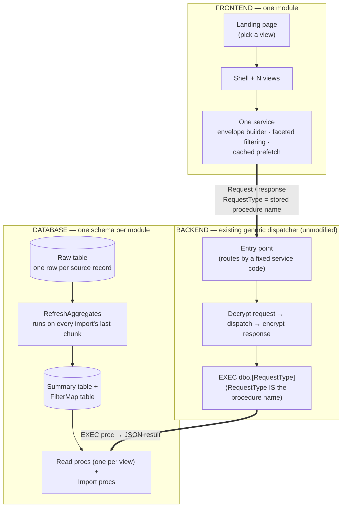
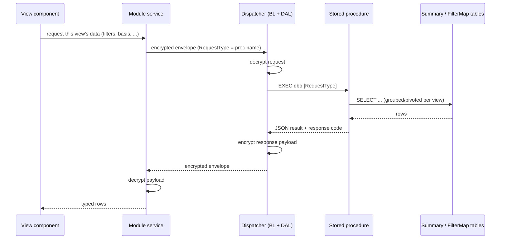
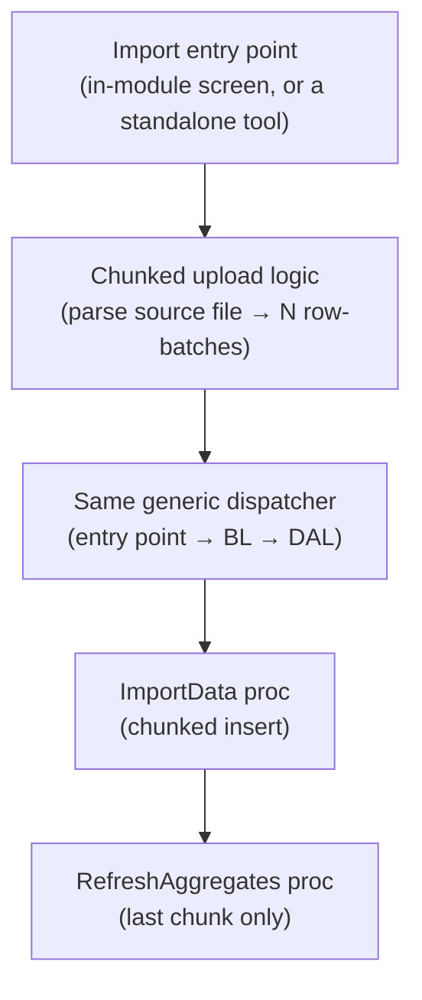

# Dashboard UI/UX Framework — End-to-End Flow (Generic)

Three layers, top to bottom. Each layer's own steps run straight down; the
two connections *between* layers both point the same direction so nothing
crosses.

**Reading it**: a click in any view flows down through the module's one
service, into the platform's existing generic dispatcher (no module-
specific backend code exists — see `Backend.md`), which executes the stored
procedure whose name **is** the `RequestType` the frontend sent, against
the summary/filter tables that the refresh procedure keeps in sync with the
raw table on every import.

---

## Request/response round trip

A single view request, in time order — a sequence diagram, so nothing can
visually cross regardless of how many steps are added:

---

## Import — a separate path

An import does not have to go through the module's own service at all. A
common shape: a dedicated upload flow (in-module or a standalone tool) that
talks to the **same** dispatcher and the **same** procedures every other
request uses.

The two flows converge at the same dispatcher and the same refresh step —
an import is what makes the *next* dashboard-view request (the first flow
above) return fresh numbers.
